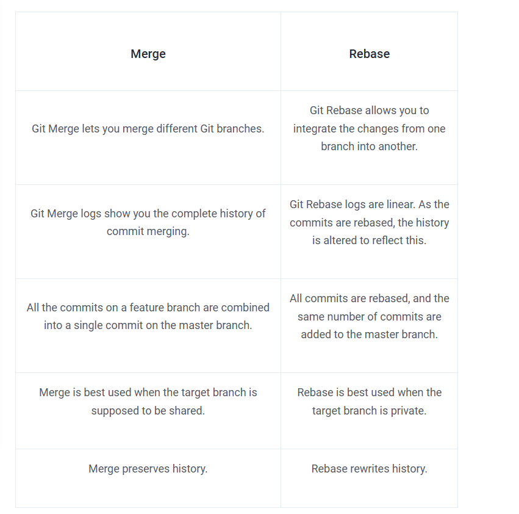
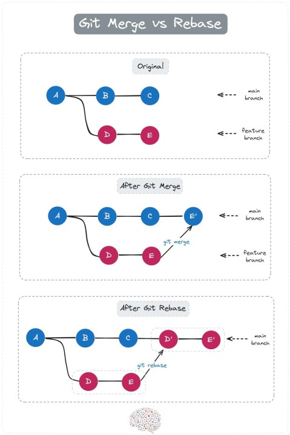

# Understanding the Git Pull Operation

The `git pull` command is an essential tool in Git, allowing developers to keep their local repositories synchronized with the latest updates from a remote repository. It performs two operations in one step:

1. **Fetch**: Downloads the latest changes from the remote repository.
2. **Merge**: Integrates those changes into the current branch of the local repository.

This ensures that your local copy is up-to-date with the work of other contributors.

## Commands Used in the Pull Operation

### Fetch Changes
To manually fetch updates from the remote repository, you can use the command:
```bash
git fetch <remote-name>
```
By default, the remote name is `origin`. This command downloads the latest changes but does not merge them automatically.

### Merge Changes
To merge the fetched changes into your current branch, use:
```bash
git merge <branch-name>
```
This integrates the updates from the remote branch into your local branch.

### Pull Changes (Fetch + Merge)
The `git pull` command combines both fetch and merge operations in a single step:
```bash
git pull <remote-name> <branch-name>
```
For example:
```bash
git pull origin main
```
This fetches and merges updates from the `main` branch of the `origin` remote repository.

## Example Workflow
1. Ensure you are on the branch you want to update:
   ```bash
   git checkout <branch-name>
   ```
2. Pull the latest changes from the remote repository:
   ```bash
   git pull origin <branch-name>
   ```
   Replace `<branch-name>` with the name of your branch (e.g., `main` or `dev`).

## Removing Branches Locally and Remotely

### Remove a Branch Locally
To delete a branch from your local repository, use:
```bash
git branch -d <branch-name>
```
If the branch has not been merged, use:
```bash
git branch -D <branch-name>
```
The `-D` flag forces deletion of the branch.

### Remove a Branch Remotely
To delete a branch from the remote repository, use:
```bash
git push <remote-name> --delete <branch-name>
```
For example:
```bash
git push origin --delete feature-branch
```
This removes the `feature-branch` from the `origin` remote.

## Managing Tags in Git

### List Tags Locally
To list all tags in your local repository, use:
```bash
git tag
```

### Delete a Tag Locally
To delete a tag from your local repository, use:
```bash
git tag -d <tag-name>
```
For example:
```bash
git tag -d v1.0
```

### Delete a Tag Remotely
To delete a tag from the remote repository, use:
```bash
git push <remote-name> --delete <tag-name>
```
For example:
```bash
git push origin --delete v1.0
```
Alternatively, you can push an empty reference to the tag:
```bash
git push origin :refs/tags/<tag-name>
```

## Understanding Git Rebase

The `git rebase` command is used to integrate changes from one branch into another by moving the base of the branch to a new starting point. Unlike `git merge`, which creates a merge commit, `git rebase` rewrites the commit history to make it linear.
Git rebase is a command that lets users integrate changes from one branch to another. Once the action is complete, the logs are modified. Git rebase was developed to overcome merging’s shortcomings, specifically regarding logs.

### Difference between rebase and merge:


### Example:


### Benefits of Rebase:
- Creates a clean, linear commit history.
- Makes it easier to review changes.

## Adding an Image


